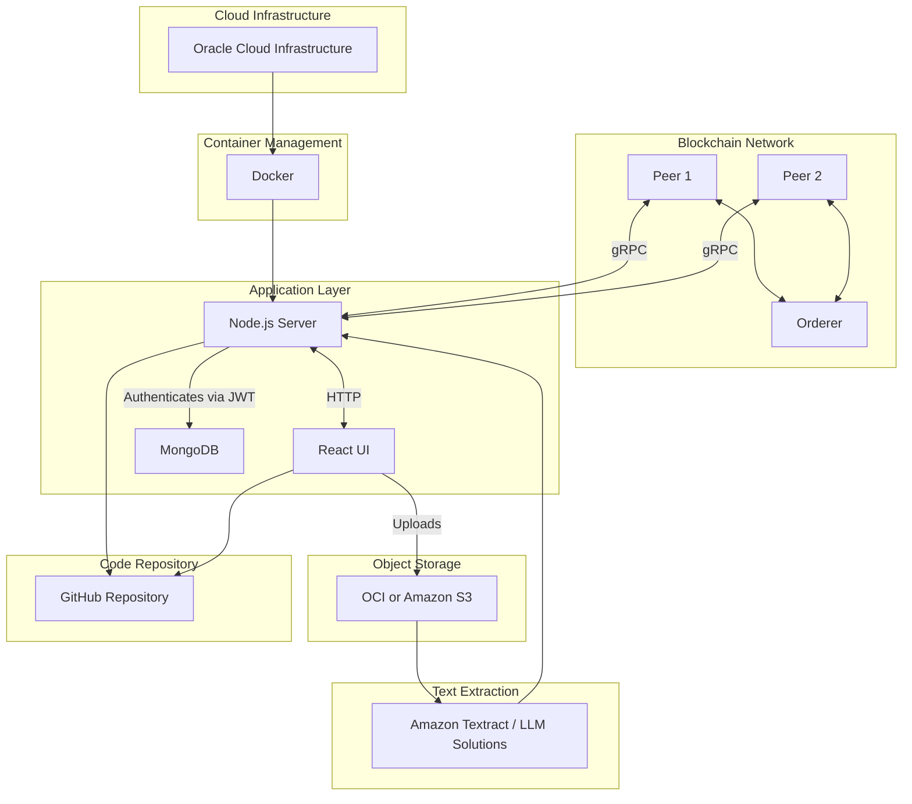

### Interns

- Brain Tran, Henry Nguyen, Jonah Nathan, Matthew Fuentes James

### Senior Software Engineer

- Dr. Cristian Mateos ( [Website](https://users.exa.unicen.edu.ar/~cmateos/) )

### Product Owner

- Toe Arkar ( [GitHub](https://github.com/Toe12) )

