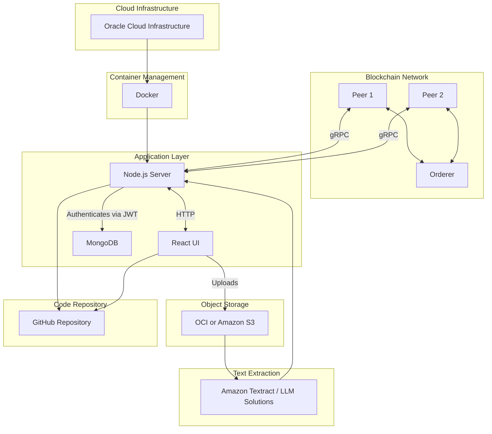

# Blockchain-Based Mortgage Policy Exchange System

## Project Overview

This project implements a blockchain-based system for mortgage policy exchange, developed in collaboration with the University of Nebraska Omaha (UNO). The system facilitates secure and transparent management of mortgage policies using blockchain technology.

## System Architecture




## Technology Stack

### Backend Infrastructure

- **Blockchain Network**: Hyperledger Fabric
- **Server**: Node.js with Express.js
- **Database**: MongoDB Atlas
- **Authentication**: JWT
- **Cloud Platform**: Oracle Cloud Infrastructure (OCI)

### Frontend

- **Framework**: React & Astro
- **Deployment**: Vercel

### Storage & Processing

- **Object Storage**: OCI/Amazon S3
- **Document Processing**: Amazon Textract
- **AI Processing**: LLM Solutions (Groq)

### DevOps & Monitoring

- **Containerization**: Docker
- **Version Control**: GitHub
- **CI/CD**: GitHub Actions

## Features

- Secure blockchain-based policy management
- Document processing with Amazon Textract and LLM solutions
- JWT-based authentication
- Cloud-based storage using OCI/Amazon S3
- Containerized deployment with Docker
- Real-time policy status tracking
- Multi-organization support
- Real-time metrics monitoring

## Development Team

### Fall 2024

- Brain Tran
- Henry Nguyen
- Jonah Nathan
- Matthew Fuentes James

### Spring 2025

- Ben Wesch
- Evan Hoffschneider
- Rashawn Thompson
- Vincent Buda

### Project Leadership

#### Senior Software Engineer

- Cristian Mateos, PhD ( [Link](https://users.exa.unicen.edu.ar/~cmateos/) )

#### Product Owner

- Toe Arkar ( [Link](https://toearkar.vercel.app/) )

## Getting Started

### Prerequisites

- Node.js ≥ 18
- Docker & Docker Compose
- MongoDB
- Access to OCI or AWS S3
- Hyperledger Fabric development environment

### Installation

1. Clone the repository

```bash
git clone https://github.com/Insurmate-app/Insurmate.git
cd unomaha
```

2. Install dependencies

```bash
# Backend
cd backend
npm install

# Frontend
cd ../frontend
npm install
```

3. Set up environment variables

- Copy `.env.example` to `.env`
```bash
cp backend/.env.example backend/.env
```
- Configure required environment variables:
  - Database connection
  - JWT settings
  - Cloud storage credentials
  - LLM API keys
  - Frontend URLs

4. Start development servers

```bash
# Backend
cd backend
npm run dev

# Frontend
cd ../frontend
npm run dev
```

## Project Structure

```
/
├── backend/          # Node.js server code
│   ├── blockchain/   # Hyperledger Fabric configuration
│   └── test/         # Backend tests
├── frontend/
│   ├── public/       # Static assets
│   └── src/          # React components and pages
└── docs/             # Project documentation
```

## Acknowledgements

This project is developed in collaboration with the University of Nebraska Omaha (UNO). We extend our gratitude to UNO for their support and resources in making this blockchain-based mortgage policy exchange system possible.

### Special Thanks

- Harvey Siy, PhD
- Alfredo Perez, PhD

## License

This project is licensed under the MIT License.
