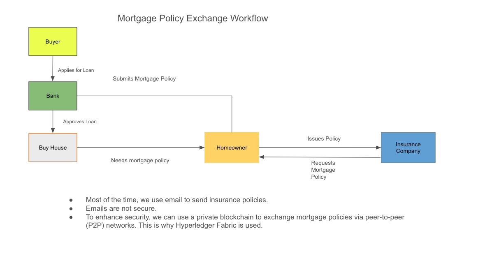
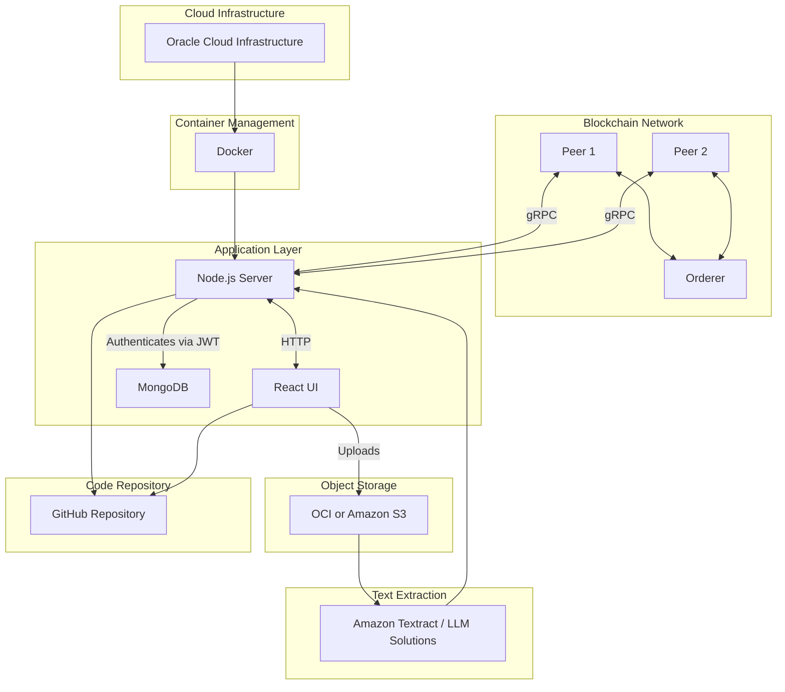

## Collaborators 
### Fall 2024 
- Brain Tran, Henry Nguyen, Jonah Nathan, Matthew Fuentes James

### Spring 2025
- Ben Wesch, Evan Hoffschneider, Rashawn Thompson, Vincent Buda

### Senior Software Engineer

- Cristian Mateos, PhD ( [Link](https://users.exa.unicen.edu.ar/~cmateos/) )

### Product Owner

- Toe Arkar ( [Link](https://toearkar.vercel.app/) )

### Acknowledgements

This project is developed in collaboration with the University of Nebraska Omaha (UNO). We extend our gratitude to UNO for their support and resources in making this blockchain-based mortgage policy exchange system possible.

Special thanks to:
- Harvey Siy, PhD, Alfredo Perez, PhD 

