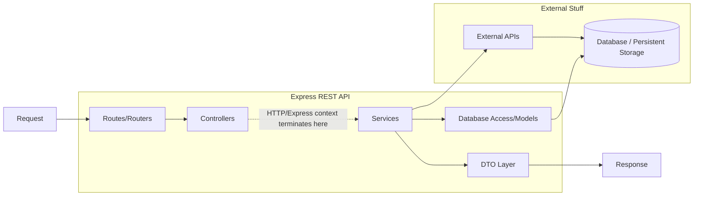

### Express JS Architecture



### MongoDB Setup

To set up MongoDB and manage Docker containers and volumes, use the following commands:

1. **Restart MongoDB**  
   Run the script to restart MongoDB:
   ```bash
   ./scripts/mongo_db_restart.sh
   ```

2. **Remove MongoDB**  
   If you need to remove the MongoDB container and associated volumes, use:
   ```bash
   ./scripts/mongo_db_remove.sh
   ```

### Starting the Node.js Application

To start the Node.js application, follow these steps:

1. **Navigate to the Backend Folder**  
   Ensure you're in the backend directory:
   ```bash
   cd backend
   ```

2. **Install Dependencies**  
   Download all required npm packages from `package.json`:
   ```bash
   npm install
   ```

3. **Run the Development Server**  
   Start the application in development mode:
   ```bash
   npm run dev
   ```

### Postman Collection
[Postman Collection](app.postman_collection.json)