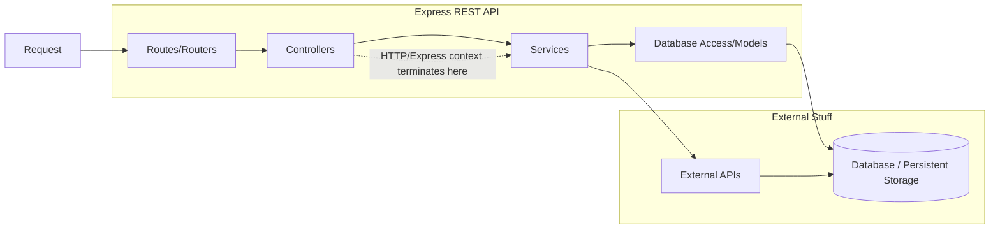

### Express JS Architecture

```mermaid
flowchart LR
    A[Request] --> B[Routes/Routers]
    B --> C[Controllers]
    C --> D[Services]
    D --> E[Database Access/Models]
    D --> F[External APIs]
    E --> G[(Database / Persistent Storage)]
    F --> G

    subgraph Express REST API
        B
        C
        D
        E
    end

    subgraph External Stuff
        F
        G
    end

    C -.->|HTTP/Express context terminates here| D
```
