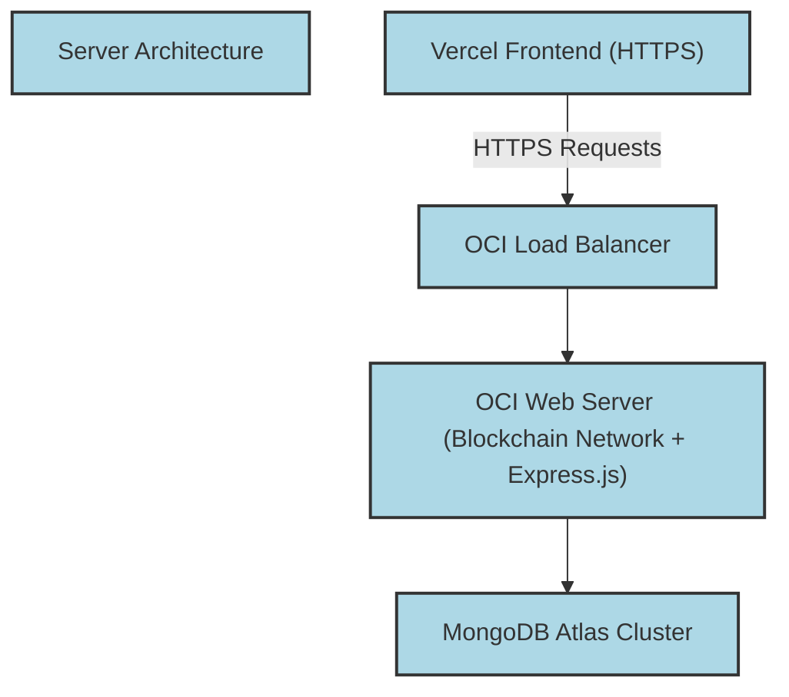

```mermaid
graph TD
    %% Title
    title["Server Architecture"]

    %% Frontend
    A["Vercel Frontend (HTTPS)"] --> |HTTPS Requests| B["OCI Load Balancer"]

    %% Load Balancer
    B --> C["OCI Web Server (Blockchain Network + Express.js)"]

    %% Web Server to Database
    C --> D["MongoDB Atlas Cluster"]

    %% Legend and Notes
    classDef node fill:#add8e6,stroke:#333,stroke-width:2px;
    class A,B,C,D,E,title node;
```